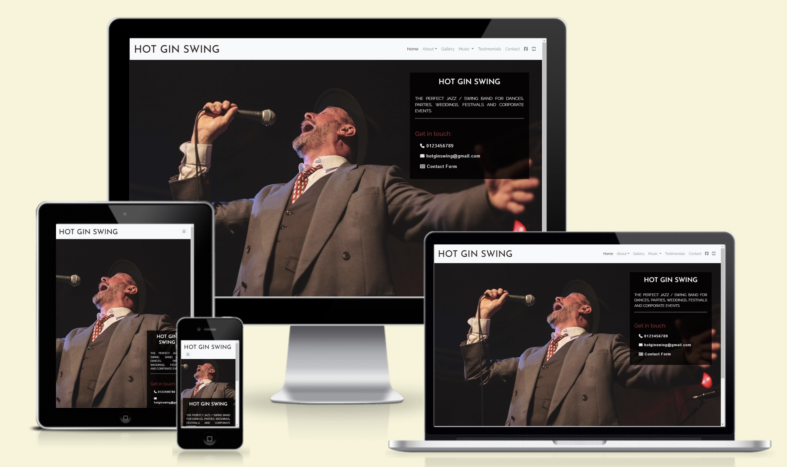
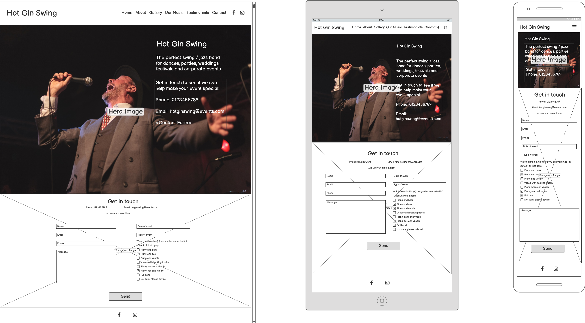
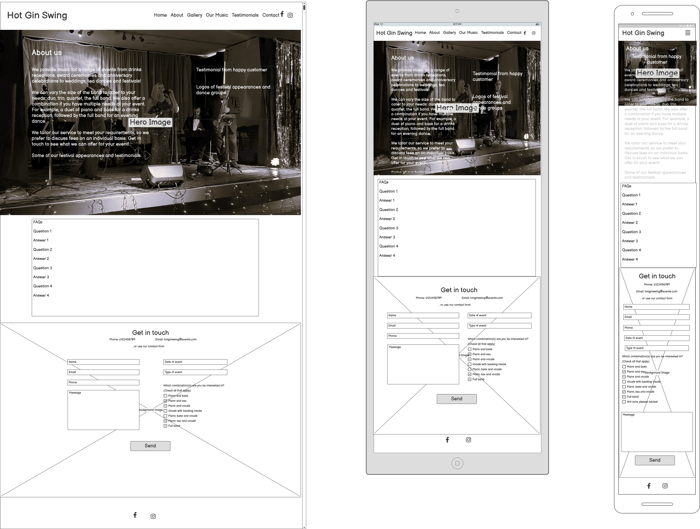
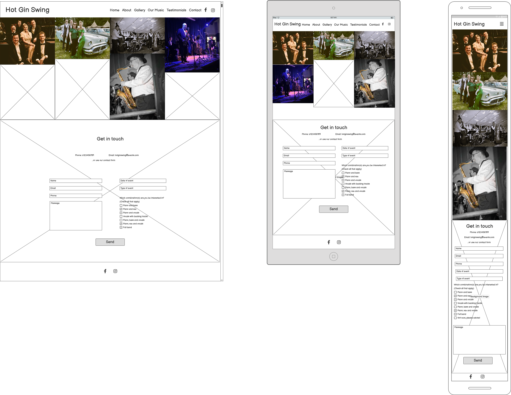
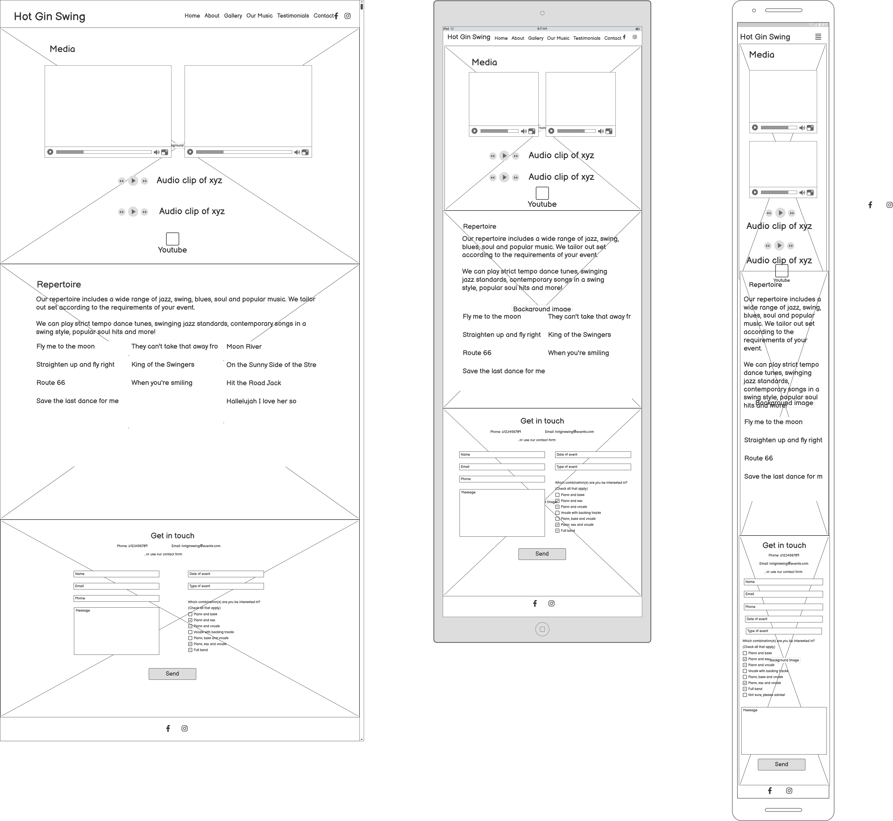
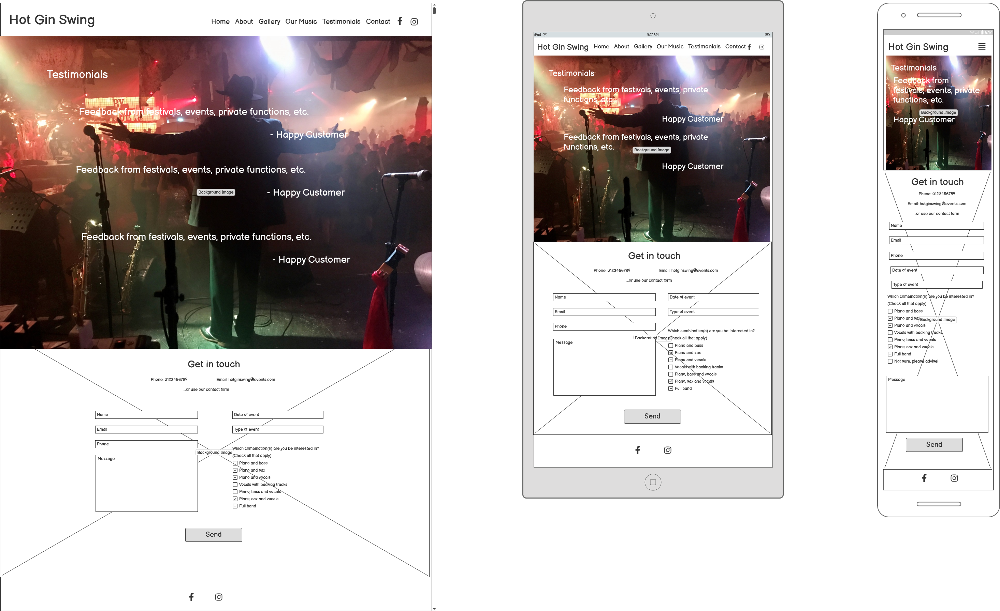
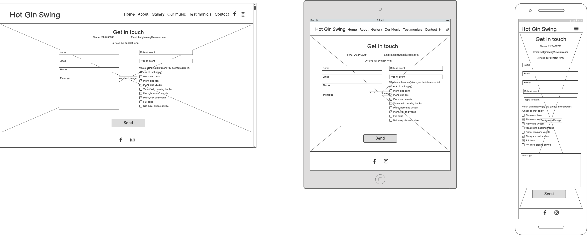

# **Hot Gin Swing**

Hot Gin Swing is a 6-piece jazz/swing band based in South Wales. With a growing reputation and increasing number of regular performances, the band is looking to improve the quality of their online presence. The site is targeted at prospective clients who might be interested in booking the band for a private function or public event. It introduces users to the band and provides information about the type of musical services they offer, examples and images of their performances, testimonials, and contact details.

Welcome to the site! [**Hot Gin Swing**](https://mksambell.github.io/band_website_hot_gin_swing/)

## Contents
1. [**User Experience UX**](#1-user-experience-ux)
    - [Strategy](#strategy)
	- [User Stories](#user-stories)
    - [Site Structure](#site-structure)
    - [Wireframes](#wireframes)
    - [Surface](#surface)
2. [**Features**](#2-features)
	- [Existing Features](#existing-features)
		- [Home](#existing-features)
			- [Navigation bar](#navigation-bar)
			- [Hero image](#hero-image)
			- [Footer](#footer)
	- [Future Features](#future-features)
3. [**Technology used**](#3-technology-used)
4. [**Testing**](#4-testing)
	- [Bugs](#bugs)
5. [**Deployment**](#5-deployment)
6. [**Credits**](#6-credits)
7. [**Acknowledgements**](#7-acknowledgements)

# 1. User Experience UX

## Strategy

### Band goals

The band's main aim is to get more bookings. They therefore want to increase and improve their online presence, providing information about their music and availability in a professional-looking format. 

They have a presence on Facebook and Youtube where they post upcoming gigs, videos and photos of performances and booking details, but often potential clients ask to see a website. They would like to direct potential clients to the website as the main source of information about the band.

The website will also be an opportunity to establish a 'house style' for the band in terms of font, colour, logo and image format, which can then be used on promotional material and on the band's social media. This 'house style' could also be made available to clients (particularly festival and dance organisers) as a promotional pack.

Users may access the website for a number of reasons. They could be:
- an event organiser already considering booking the band, looking for confirmation as to the quality of the band's music and suitability for their event
- an event organiser browsing/searching for musical acts in their region
- a casual visitor, or someone who has heard the band at a performance and wants to find out more

[Back to contents](#contents)

## User stories

As a potential client, I want:
1. To find out basic information about the band
2. To hear/watch examples of the band's performances
3. To find out about the range of musical services they offer
4. To read testimonials about the band's performances from other clients
5. To be able to get in touch easily to make an enquiry
6. To see images of the band's appearance
7. To know that the band will be friendly and easy to deal with
8. To find out about the band's repertoire and the styles of music they perform
9. To find my way easily around the site
10. To know how to connect with the band on social media

[Back to contents](#contents)

## Site Structure

The site is structured with six pages:

[*Home*](index.html)
- The landing page contains a hero image, a brief description of the band and contact information

[*About*](about.html)
- General information about the band
- A brief testimonial
- Link to band's facebook page
- FAQs to answer some general questions users may have

[*Gallery*](gallery.html)
- A range of images of the band

[*Music*](music.html)
- A selection of video clips of the band's performances
- Information about the band's repertoire
- Link to band's Youtube channel

[*Testimonials*](testimonials.html)
- A range of testimonials
- Logos of festivals at which the band has performed

[*Contact*](contact.html)
- Contact information
- A contact form. When submitted a [enquiry receipt](contact-received.html) page displays
- There is a link to a [privacy policy](privacy.html) in the footer

[Back to contents](#contents)

## Wireframes

The following wireframes were created in [Balsamiq](https://balsamiq.com/) and include responsive design ideas for Laptop, Tablet and Mobile devices. The final design differs from the wireframes due to changes made in the design process. For example, the contact form does not appear at the bottom of every page. It was felt that there was sufficient access to it through the home page, navbar and footer and that it would be unnecessary and annoying to the user.

### Home
  
### About

[Back to contents](#contents)
### Gallery

### Music

[Back to contents](#contents)
### Testimonials
  
### Contact

[Back to contents](#contents)

## Design choices

**Typography**

The fonts chosen were:

- Josefin Sans
	- Used in uppercase for the main logo. This has a vintage 1930s/1940s feel which suits the style of the band. In uppercase and with sufficient weight, it is bold and eyecatching.
- Raleway
	- Used for navbar links, page headings, highlighted taglines and in italics for testimonials. Complements the main logo font well.
- Source Sans
	- Used for the main body of the text. Very easy to read.

All fonts default to sans serif.

**Icons**

A handful of [FontAwesome](https://fontawesome.com/) icons are used to draw attention to contact information throughout the site:
- Phone
- Envelope (for email)
- Checkist (for contact form)
- List (to replace default navbar toggler)

[Back to contents](#contents)

**Colours**

The colour scheme was chosen to reflect the formal wear the band plays in (DJs, white shirts, sparkly ball gowns) and also a sense of the muted colours of vintage style; a high contrast between two types of black and an off-white with two splashes of red, both taken from the colour of the tie in the hero image on the landing page. The lighter colour is used against black backgrounds to provide a higher contrast; the darker red is used against the off white in the navbar and footer.

**Styling**

- The aim is to minimise the written content and major on the visual impact of images, audio/video and clear layout.
- The highest volume of text will be on the About page:
    - This will be broken up into sections with different visual cues for the About us and FAQ section.

**Images and backgrounds**

- A range of images from the band's performances have been used as background images and in the Gallery section
- To give a consistent sense of style, saturation has been reduced and a warm filter has been applied.
- Background images that are too bright are overlayed with an opaque layer to ensure the text is clear.
- Size and resolution of images have been adjusted to ensure that they load as quickly as possible to maximise the user experience. 

[Back to contents](#contents)

## 2. Features

The site is intended to be easy to navigate around and intuitive to use. Common pages, terminology and icons are used to help the user find their way around easily, and high contrast between font and background has been used to make the text immediately clear.

## Existing Features

### Navigation Bar
- The navbar is fixed at the top of every page so that at any point, a user can navigate to any other main page. 
- The name/logo of the band is fixed in the left of the navbar and is a link to the home page
- The dropdown menus for the About and Music pages provide links to the FAQ and Repertoire sections respectively
- Active links are shown in bold to show the user where they are in the site.
- Links turn red when hovered over as shown in the pictures below.
- On mobile and tablet devices, the nav menu appears as a list icon. The default Bootstrap has been replaced with a more elegant icon from FontAwesome.
- The social media links only appear in the navbar at laptop size; they are hidden in mobile and tablet version to avoid cluttering the interface. The same links are permanently in the footer.

*Navbar expanded*

*Navbar collapsed (logo with hover colour activated)*

[Back to contents](#contents)

### Hero Image 
- A full screen picture of the band's lead singer in full swing greets the user on the landing page.
- A fully responsive text box gives a brief description of the band, and key contact info.
- The contact form link takes users to the Contact page.
- At all viewport sizes, the singer's face (and energy) remains central, the text box positioned either along the right or bottom edge.

*Hero image on laptop and mobile*

[Back to contents](#contents)

### Footer
- Sited at the bottom of every page (discovered by scrolling), the footer contains the logo, which acts as a link to the home page, contact information, links to social media, link to privacy page, and copyright information.
- To enhance the UX, as with the navbar, all the links show red when the pointer hovers over them.
- Social media links open their targets in a new tab, so that users can retain their location on the site.
- The privacy policy page contains the same navbar and footer, so users can easily navigate back onto the main pages of the site.
- The contact form link takes users to the Contact page.
- The footer information stacks for mobile users.

*Footer - tablet size and larger*

[Back to contents](#contents)

### About us
- The About page lets the user know who the band is and what they do.
- The picture of a relaxed, smiling, smartly dressed band gives the user confidence that they are dealing with a professional and friendly group.
- An inline link and invitation in the text to the band's Facebook encourages the user to find out more about the band.

[Back to contents](#contents)

### FAQs
- This section sits underneath the 'About us' section on the About page.
- It offers users further information about what the band can offer, and what clients can expect when dealing with the band.
- The question and answer format breaks up the text, making it more accesible - the contrast in colour also helps the user navigate through this section.
- There is an invitation and signpost to use the contact form to make a further enquiry.

[Back to contents](#contents)

### Gallery
- The gallery shows the user a range of pictures of the band in action in various venues and events.
- The images have been edited to mute the colours and saturation slightly, to give a vintage feel, to suit the vibe of the band.
- The opacity of each picture increases as the mouse hovers over it; this offers a little interactivity for the user.

[Back to contents](#contents)

### Media
- The Music page contains two sections - Media and Repertoire
- Media contains embedded videos showing examples of the band's performances
- The videos are embedded from the band's Youtube channel, offering the user chance to explore more.
- The videos have the capacity to be made fullscreen, enhancing the user experience.

[Back to contents](#contents)

### Repertoire
- This section gives more specific information about the songs and style of music the band plays.
- A broad list of songs and covered artists gives the user better chance to engage.
- An inline invitation to use the contact form for a friendly discussion further encourages the user to engage directly with the band.

[Back to contents](#contents)

### Testimonials
- A selection of brief testimonials is given to further encourage the user that the band is trustworthy, friendly to deal with and can perform to a high standard.
- The testimonial text is italicised to personalise and separate it from the rest of the site's text.
- Three links to festivals and venues that the band have previously played at are included below the testimonials, though only on laptop screens and larger. These indicate that the band have performed professionally for national public events, and also emphasise the band's vibe.

[Back to contents](#contents)

### Contact
- The contact form is the last page indicated on the navigation menu and is signposted throughout the site as the next step for the user's interaction with the site. It therefore acts as a kind of end point of the user's journey.
- Phone and email information is given, in case the user decides at this stage that they would prefer to use these contact methods.
- To enhance user experience, the only fields required are name and email, and the formatting of date and type of event is left to the user to decide. The band do not need to collate this data into a database, so formatting is not critical. It is more important that the user is encouraged to get in touch with the band.
- The checklist options about band size are not required - they are intended as a guide to the user's thinking. There is an option for the user to ask for further advice.
- To enhance UX, the colours of the 'send enquiry' button reverse when the mouse hovers over it.

[Back to contents](#contents)

### Contact receipt
- This is the page that will display when a user submits an enquiry.
- The message maintains the friendly and helpful tone, further enhancing the UX.
- The page displays with navbar and footer so that the user can easily navigate back to any page on the site.

[Back to contents](#contents)

### Privacy policy
- This page is accessed through the footer, which is present on every page.
- It offers users confidence that any information they give to the band through the contact form, or through other means of contact, will be handled securely, and that it is gathered solely for the purpose of being able to offer their services to the user.
- The page displays with navbar and footer so that the user can easily navigate back to any page on the site.

[Back to contents](#contents)

## Future features

- Connect contact form to a server to operate functionally
	- This would include replacing the boilerplate privacy policy with a more detailed one.
- Link to a selection of studio-recorded audio clips
	- This could potentially include a download/purchase option for some of the band's recordings
- An upcoming gigs section
- A link to download a promotional pack, including logo, photos, etc that clients could use to promote their event.
- The email address given is real; the phone number will need to be replaced.

[Back to contents](#contents)

## 3. Technology used

- The wireframes were created using [Balsamiq](https://balsamiq.com/)
- The structure of the site was written in [HTML5](https://html.spec.whatwg.org/)
- The site was styled using [CSS](https://www.w3.org/Style/CSS/Overview.en.html)
- [Bootstrap 4.2](https://getbootstrap.com/docs/4.2/layout/grid/) was used to create the grid system and provide some styling
- The site was developed in [Gitpod](https://www.gitpod.io/) using a Github template from [Code Institute](https://github.com/Code-Institute-Org/ci-full-template)
- [Github](https://github.com/) was used for version control and for hosting
- [Google Chrome Developer Tools](https://developer.chrome.com/docs/devtools) were used throughout development and for testing
- Images were resized and edited using [TinyJPG](https://tinyjpg.com/) and [RedKetchup](https://redketchup.io/image-resizer)

[Back to contents](#contents)

## 4. Testing

For full testing details, including code validation, bugs, user story tests and developer tools tests, please see the separate [Testing](/TESTING.md) document.

## 5. Deployment

### To deploy the project on Github Pages

  1. In the GitHub repository, go to Settings.
  2. In Settings, navigate to the Pages tab on the left hand side.
  3. Under Source, select the branch to master, then click save.
  4. Once the master branch has been selected, the page will be automatically refreshed with a detailed ribbon display to indicate the successful deployment.

  

  The live link to the repository can be found [here](https://github.com/mksambell/band_website_hot_gin_swing)

  ### To fork the repository on Github

A copy of the GitHub Repository can be made by forking the GitHub account. This copy can be viewed and changes can be made to the copy without affecting the original repository. Take the following steps to fork the repository:

1. Log in to GitHub and locate the repository.
2. On the right hand side of the page inline with the repository name is a button called 'Fork'. Click on the button to create a copy of the original repository in your GitHub Account.

### To clone the project

1. Under the repository’s name, click on the code tab.
2. In the 'Clone with HTTPS' section, click on the clipboard icon to copy the given URL.
3. In your IDE, open Git Bash.
4. Change the current working directory to the location where you want the cloned directory to be made.
5. Type 'git clone', and then paste the URL copied from GitHub.
6. Press enter and the local clone will be created.

[Back to contents](#contents)

## 6. Credits

### Code

- Navbar code copied from [Bootstrap](https://getbootstrap.com/docs/4.2/components/navbar/#placement) and substantially edited and styled
- Embed code for iframes copied from [Youtube](https://www.youtube.com/watch?v=-6qFbtDSqgM)

### Content

- Fonts from [Google Fonts](https://fonts.google.com/)
- Icons from [FontAwesome](https://fontawesome.com/)
- Colour palette created with [Coolors](https://coolors.co/)

### Media

- Contact page background image by Ardian Lumi, downloaded from [Unsplash](https://unsplash.com/photos/group-of-people-dancing-6Woj_wozqmA)
- FAQ background image by Miti, downloaded for free from [Unsplash](https://unsplash.com/photos/person-playing-cielo-black-and-white-photography-vSws0g1KjxI)
- About page background image by Jens Thekkeveettil, downloaded for free from [Unsplash](https://unsplash.com/photos/person-playing-saxophone-dBWvUqBoOU8)
- Media background image by Daniel Lazar, downloaded for free from [Unsplash](https://unsplash.com/photos/brown-and-white-piano-keys-KWUuFjXWzcI)
- All other images taken by the developer, Mark Sambell, and other members of the band.

[Back to contents](#contents)

## 7. Acknowledgements

This site was developed as my first Milestone Project for the Full Stack Software Developer Diploma at Code Institute. I would like to thank my mentor, [Precious Ijege](https://www.linkedin.com/in/precious-ijege-908a00168/), and all at Code Institute for their help and support. I would also like to thank the incredible musicians of Hot Gin Swing for their kind permission to use content in the development of the project. If you ever need to book a jazz/swing band, look no further than [Hot Gin Swing](https://mksambell.github.io/band_website_hot_gin_swing/index.html)!

Mark Sambell 2024

[Back to contents](#contents)